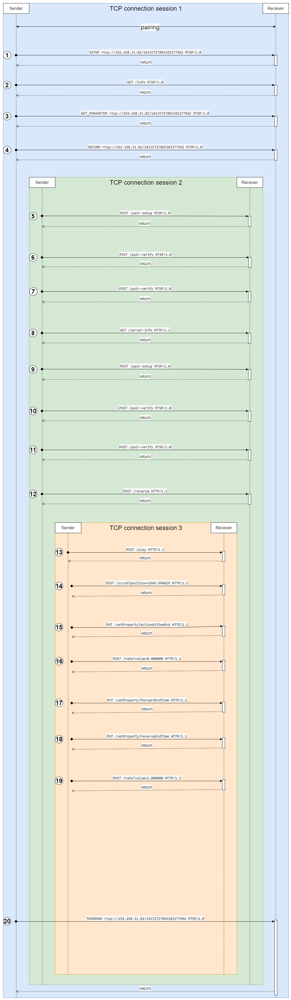

# Media Cast Service

[](images/media-cast-service.png)

```
AP Server is starting....
[DEBUG]ap_airplay_connection (000002BE85E99AE0) is being created
[DEBUG]Session (000002BE85E99AE0) is waiting
[DEBUG]AP service running on 57619
[DEBUG]Session (000002BE85EA6680) is waiting
[DEBUG]Media service running on 57620
AP Server started....
[DEBUG]Session (000002BE85E99AE0) accepted and started
[DEBUG]ap_airplay_connection (000002BE85EB0890) is being created
[DEBUG]Session (000002BE85EB0890) is waiting
[DEBUG][3017313721056]<<<<<<<<<<<<<<<<<<<<<<<<<<<<<<<<<<< 
    Request: GET /info RTSP/1.0
    Header:
        Active-Remote: 4002970562
        CSeq: 0
        Content-Length: 70
        Content-Type: application/x-apple-binary-plist
        DACP-ID: 481EC7990FC1C1C0
        User-Agent: AirPlay/425.1
        X-Apple-ProtocolVersion: 1
    Body:bplist00?Yqualifier?ZtxtAirPlay                            "
[DEBUG][3017313721056]<<<<<<<<<<<<<<<<<<<<<<<<<<<<<<<<<<< 
    Request: POST /fp-setup RTSP/1.0
    Header:
        Active-Remote: 4002970562
        CSeq: 1
        Content-Length: 16
        Content-Type: application/octet-stream
        DACP-ID: 481EC7990FC1C1C0
        User-Agent: AirPlay/425.1
        X-Apple-ET: 32
    Body:FPLY     ?
[DEBUG][3017313721056]<<<<<<<<<<<<<<<<<<<<<<<<<<<<<<<<<<< 
    Request: POST /fp-setup RTSP/1.0
    Header:
        Active-Remote: 4002970562
        CSeq: 2
        Content-Length: 164
        Content-Type: application/octet-stream
        DACP-ID: 481EC7990FC1C1C0
        User-Agent: AirPlay/425.1
        X-Apple-ET: 32
    Body:FPLY    ??湗攇婢祭>.]惧輳貗戱泑 瑕艏?C瞠耛D赕|x?茆?N夥笐袌p垿纐e裆颚?YB硠 犣欆傋?G迷"?B帤纀瑴滆?2-w頯
渘悄?h  瀣i檳廀4?咪?
蘒JG栰烒留??
[DEBUG][3017313721056]<<<<<<<<<<<<<<<<<<<<<<<<<<<<<<<<<<< 
    Request: SETUP rtsp://192.168.31.82/14135727865383177962 RTSP/1.0
    Header:
        Active-Remote: 4002970562
        CSeq: 3
        Content-Length: 499
        Content-Type: application/x-apple-binary-plist
        DACP-ID: 481EC7990FC1C1C0
        User-Agent: AirPlay/425.1
    Body:bplist00?	

RetSeiv^timingProtocol[sessionUUIDVosName^osBuildVersion]sourceVersionZtimingPortYosVersionTekeyXdeviceIDUmodelTnameZmacAddress O鑭┟i突n?~覵NTP_$C42C3199-69C1-4EEA-B457-1C782563B496XMac OS XV19H524U425.1菡W10.15.7OHFPLY    <    玱錄籞輖<~王仴珕   /??y?茅@蒲沥f繠"I?{oJ'燞_88:66:5A:15:D7:E1^MacBookPro16,1_SHEENTIAN-MBP00_88:66:5A:15:D7:E1  % ( , ; G N ] k v € ? ? ? ? ? ? ? ? ? ? ? ? ?Pds?                           ?
###################on_mirror_session_begin: 3610747345494973152
[DEBUG][3017313721056]<<<<<<<<<<<<<<<<<<<<<<<<<<<<<<<<<<< 
    Request: GET /info RTSP/1.0
    Header:
        Active-Remote: 4002970562
        CSeq: 4
        DACP-ID: 481EC7990FC1C1C0
        User-Agent: AirPlay/425.1
        X-Apple-ProtocolVersion: 1
    Body:<EMPTY>
[DEBUG][3017313721056]<<<<<<<<<<<<<<<<<<<<<<<<<<<<<<<<<<< 
    Request: GET_PARAMETER rtsp://192.168.31.82/14135727865383177962 RTSP/1.0
    Header:
        Active-Remote: 4002970562
        CSeq: 5
        Content-Length: 8
        Content-Type: text/parameters
        DACP-ID: 481EC7990FC1C1C0
        User-Agent: AirPlay/425.1
    Body:volume


[DEBUG][3017313721056]<<<<<<<<<<<<<<<<<<<<<<<<<<<<<<<<<<< 
    Request: RECORD rtsp://192.168.31.82/14135727865383177962 RTSP/1.0
    Header:
        Active-Remote: 4002970562
        CSeq: 6
        DACP-ID: 481EC7990FC1C1C0
        User-Agent: AirPlay/425.1
    Body:<EMPTY>
[DEBUG]Timing query packet sent successfully
[DEBUG]Timing reply packet received successfully
[DEBUG]Session (000002BE85EB0890) accepted and started
[DEBUG]ap_airplay_connection (000002BE85EC6010) is being created
[DEBUG]Session (000002BE85EC6010) is waiting
[DEBUG][3017313814672]<<<<<<<<<<<<<<<<<<<<<<<<<<<<<<<<<<< 
    Request: POST /pair-setup RTSP/1.0
    Header:
        Content-Length: 32
        Content-Type: application/octet-stream
        User-Agent: AirPlay/425.1
        X-Apple-Device-ID: 0x88665a15d7e1
        X-Apple-Session-ID: 00b2c4a9-42eb-48c3-b580-b12b83582578
    Body:c欀?榫*?@鎉嶵寂+=?è倹??
[DEBUG][3017313814672]<<<<<<<<<<<<<<<<<<<<<<<<<<<<<<<<<<< 
    Request: POST /pair-verify RTSP/1.0
    Header:
        Content-Length: 68
        Content-Type: application/octet-stream
        User-Agent: AirPlay/425.1
        X-Apple-Device-ID: 0x88665a15d7e1
        X-Apple-PD: 1
        X-Apple-Session-ID: 00b2c4a9-42eb-48c3-b580-b12b83582578
    Body:   $i$? o鶂ET颂Gx?獲娹颫??c欀?榫*?@鎉嶵寂+=?è倹??
[DEBUG][3017313814672]<<<<<<<<<<<<<<<<<<<<<<<<<<<<<<<<<<< 
    Request: POST /pair-verify RTSP/1.0
    Header:
        Content-Length: 68
        Content-Type: application/octet-stream
        User-Agent: AirPlay/425.1
        X-Apple-Device-ID: 0x88665a15d7e1
        X-Apple-PD: 1
        X-Apple-Session-ID: 00b2c4a9-42eb-48c3-b580-b12b83582578
    Body:    v闈?Mq+Pd9aq呩2?
[妺（瞓渀3N?串翷哰g}コh9麈x^j*|偰鍭H蛁t甞vO
[DEBUG][3017313814672]<<<<<<<<<<<<<<<<<<<<<<<<<<<<<<<<<<< 
    Request: GET /server-info HTTP/1.1
    Header:
        Content-Length: 0
        User-Agent: AirPlay/425.1
        X-Apple-Client-Name: SHEENTIAN-MBP00
        X-Apple-Device-ID: 0x88665a15d7e1
        X-Apple-Session-ID: 00b2c4a9-42eb-48c3-b580-b12b83582578
        X-Apple-VV: 16777472
    Body:<EMPTY>
+++++++++++++++++++on_video_session_begin: 3610808750642497680
[DEBUG]Session (000002BE85EC6010) accepted and started
[DEBUG]ap_airplay_connection (000002BE85ECD6C0) is being created
[DEBUG]Session (000002BE85ECD6C0) is waiting
[DEBUG][3017313902608]<<<<<<<<<<<<<<<<<<<<<<<<<<<<<<<<<<< 
    Request: POST /pair-setup RTSP/1.0
    Header:
        Content-Length: 32
        Content-Type: application/octet-stream
        User-Agent: AirPlay/425.1
        X-Apple-Device-ID: 0x88665a15d7e1
        X-Apple-Session-ID: 00b2c4a9-42eb-48c3-b580-b12b83582578
    Body:c欀?榫*?@鎉嶵寂+=?è倹??
[DEBUG][3017313902608]<<<<<<<<<<<<<<<<<<<<<<<<<<<<<<<<<<< 
    Request: POST /pair-verify RTSP/1.0
    Header:
        Content-Length: 68
        Content-Type: application/octet-stream
        User-Agent: AirPlay/425.1
        X-Apple-Device-ID: 0x88665a15d7e1
        X-Apple-PD: 1
        X-Apple-Session-ID: 00b2c4a9-42eb-48c3-b580-b12b83582578
    Body:   侓w筄!w?od愯[R?鬆??煬/v玹c欀?榫*?@鎉嶵寂+=?è倹??
[DEBUG][3017313902608]<<<<<<<<<<<<<<<<<<<<<<<<<<<<<<<<<<< 
    Request: POST /pair-verify RTSP/1.0
    Header:
        Content-Length: 68
        Content-Type: application/octet-stream
        User-Agent: AirPlay/425.1
        X-Apple-Device-ID: 0x88665a15d7e1
        X-Apple-PD: 1
        X-Apple-Session-ID: 00b2c4a9-42eb-48c3-b580-b12b83582578
    Body:    `絶膩殛遁T[:屮犪葙?V殫垀&?o??uqB\胲*頃郎??=鵜莻+
鈀q:?
[DEBUG][3017313902608]<<<<<<<<<<<<<<<<<<<<<<<<<<<<<<<<<<< 
    Request: POST /reverse HTTP/1.1
    Header:
        Connection: Upgrade
        Content-Length: 0
        Upgrade: PTTH/1.0
        User-Agent: AirPlay/425.1
        X-Apple-Client-Name: SHEENTIAN-MBP00
        X-Apple-Device-ID: 0x88665a15d7e1
        X-Apple-Purpose: event
        X-Apple-Session-ID: 00b2c4a9-42eb-48c3-b580-b12b83582578
    Body:<EMPTY>
[DEBUG]Reverse purpose: event
[DEBUG]Session_id: 00b2c4a9-42eb-48c3-b580-b12b83582578
[DEBUG][3017313814672]<<<<<<<<<<<<<<<<<<<<<<<<<<<<<<<<<<< 
    Request: POST /play HTTP/1.1
    Header:
        Content-Length: 1494
        Content-Type: application/x-apple-binary-plist
        User-Agent: AirPlay/425.1
        X-Apple-Device-ID: 0x88665a15d7e1
        X-Apple-Session-ID: 00b2c4a9-42eb-48c3-b580-b12b83582578
        X-Transmit-Date: 2021-05-03T12:02:59.118806Z
    Body:bplist00?	

 !"#$%%&_"mightSupportStorePastisKeyRequests_playbackRestrictions_secureConnectionMsVvolume_Start-Position-Seconds_Content-LocationTuuidVinfoMsZstreamTypeYconnectMs^Start-PositionYmediaTypeVauthMsYbonjourMs_referenceRestrictions_SenderMACAddressUmodelZpostAuthMs^clientBundleID^clientProcName^osBuildVersionTrate	  #??      #        _Xhttps://manifest.googlevideo.com/api/manifest/hls_variant/file/index.m3u8?expire=1620064831&ei=3-WPYJvhOOGkz7sPh_-TwAE&ip=103.136.221.130&id=5qap5aO4i9A.0&source=yt_live_broadcast&requiressl=yes&tx=24005204&txs=24005203%2C24005204%2C24005205%2C24005206%2C24005207%2C24005208%2C24005209&hfr=1&playlist_duration=30&manifest_duration=30&maudio=1&vprv=1&go=1&nvgoi=1&keepalive=yes&fexp=24001373%2C24007246&dover=11&itag=0&playlist_type=DVR&sparams=expire%2Cei%2Cip%2Cid%2Csource%2Crequiressl%2Ctx%2Ctxs%2Chfr%2Cplaylist_duration%2Cmanifest_duration%2Cmaudio%2Cvprv%2Cgo%2Citag%2Cplaylist_type&sig=AOq0QJ8wRgIhAIoAFQbuzykYfyjo5N5X9mcCXXwZJUAae_Venz8KiOSGAiEAr0I6JeYZK9F8wZ7Xfuwz-UsS77lrsrbNWkq75GJhJgQ%3D&cpn=XDkzpOf3vwm-hik9&ibw=161600000&c=WEB&cver=2.20210429.07.00&ptk=youtube_single&oid=Kmxl2Gtmc3HFCPsrnEUTjA&ptchn=SJ4gkVC6NrvII8umztf0Ow&pltype=contentlive_$715DDAD0-E479-4A79-95AA-178B08505350+蟉streaming_88:66:5A:15:D7:E1^MacBookPro16,1_com.apple.WebKit.WebContentV19H524  7 \ s ? ? ? ? ? ? ? ? ? ? ?17BQ`otuwy??? 4Ca             '              h
[DEBUG]{
    mightSupportStorePastisKeyRequests: Unknown Type, 
    playbackRestrictions: 0, 
    secureConnectionMs: 0, 
    volume: 1, 
    Start-Position-Seconds: 0, 
    Content-Location: https://manifest.googlevideo.com/api/manifest/hls_variant/file/index.m3u8?expire=1620064831&ei=3-WPYJvhOOGkz7sPh_-TwAE&ip=103.136.221.130&id=5qap5aO4i9A.0&source=yt_live_broadcast&requiressl=yes&tx=24005204&txs=24005203%2C24005204%2C24005205%2C24005206%2C24005207%2C24005208%2C24005209&hfr=1&playlist_duration=30&manifest_duration=30&maudio=1&vprv=1&go=1&nvgoi=1&keepalive=yes&fexp=24001373%2C24007246&dover=11&itag=0&playlist_type=DVR&sparams=expire%2Cei%2Cip%2Cid%2Csource%2Crequiressl%2Ctx%2Ctxs%2Chfr%2Cplaylist_duration%2Cmanifest_duration%2Cmaudio%2Cvprv%2Cgo%2Citag%2Cplaylist_type&sig=AOq0QJ8wRgIhAIoAFQbuzykYfyjo5N5X9mcCXXwZJUAae_Venz8KiOSGAiEAr0I6JeYZK9F8wZ7Xfuwz-UsS77lrsrbNWkq75GJhJgQ%3D&cpn=XDkzpOf3vwm-hik9&ibw=161600000&c=WEB&cver=2.20210429.07.00&ptk=youtube_single&oid=Kmxl2Gtmc3HFCPsrnEUTjA&ptchn=SJ4gkVC6NrvII8umztf0Ow&pltype=contentlive, 
    uuid: 715DDAD0-E479-4A79-95AA-178B08505350, 
    infoMs: 43, 
    streamType: 1, 
    connectMs: 207, 
    Start-Position: 0, 
    mediaType: streaming, 
    authMs: 0, 
    bonjourMs: 0, 
    referenceRestrictions: 3, 
    SenderMACAddress: 88:66:5A:15:D7:E1, 
    model: MacBookPro16,1, 
    postAuthMs: 0, 
    clientBundleID: com.apple.WebKit.WebContent, 
    clientProcName: com.apple.WebKit.WebContent, 
    osBuildVersion: 19H524, 
    rate: 0, 
}
on_video_play: https://manifest.googlevideo.com/api/manifest/hls_variant/file/index.m3u8?expire=1620064831&ei=3-WPYJvhOOGkz7sPh_-TwAE&ip=103.136.221.130&id=5qap5aO4i9A.0&source=yt_live_broadcast&requiressl=yes&tx=24005204&txs=24005203%2C24005204%2C24005205%2C24005206%2C24005207%2C24005208%2C24005209&hfr=1&playlist_duration=30&manifest_duration=30&maudio=1&vprv=1&go=1&nvgoi=1&keepalive=yes&fexp=24001373%2C24007246&dover=11&itag=0&playlist_type=DVR&sparams=expire%2Cei%2Cip%2Cid%2Csource%2Crequiressl%2Ctx%2Ctxs%2Chfr%2Cplaylist_duration%2Cmanifest_duration%2Cmaudio%2Cvprv%2Cgo%2Citag%2Cplaylist_type&sig=AOq0QJ8wRgIhAIoAFQbuzykYfyjo5N5X9mcCXXwZJUAae_Venz8KiOSGAiEAr0I6JeYZK9F8wZ7Xfuwz-UsS77lrsrbNWkq75GJhJgQ%3D&cpn=XDkzpOf3vwm-hik9&ibw=161600000&c=WEB&cver=2.20210429.07.00&ptk=youtube_single&oid=Kmxl2Gtmc3HFCPsrnEUTjA&ptchn=SJ4gkVC6NrvII8umztf0Ow&pltype=contentlive, session: 3610808750642497680
[DEBUG][3017313814672]<<<<<<<<<<<<<<<<<<<<<<<<<<<<<<<<<<< 
    Request: POST /scrub?position=3649.994629 HTTP/1.1
    Header:
        Content-Length: 90
        Content-Type: application/x-apple-binary-plist
        User-Agent: AirPlay/425.1
        X-Apple-Device-ID: 0x88665a15d7e1
        X-Apple-Session-ID: 00b2c4a9-42eb-48c3-b580-b12b83582578
    Body:bplist00?Tuuid_$715DDAD0-E479-4A79-95AA-178B08505350                            7
on_video_scrub: 3.64999e+06
[DEBUG][3017313814672]<<<<<<<<<<<<<<<<<<<<<<<<<<<<<<<<<<< 
    Request: PUT /setProperty?actionAtItemEnd HTTP/1.1
    Header:
        Content-Length: 54
        Content-Type: application/x-apple-binary-plist
        User-Agent: AirPlay/425.1
        X-Apple-Device-ID: 0x88665a15d7e1
        X-Apple-Session-ID: 00b2c4a9-42eb-48c3-b580-b12b83582578
    Body:bplist00?Uvalue                            
[DEBUG]actionAtItemEnd value 1
[DEBUG][3017313814672]<<<<<<<<<<<<<<<<<<<<<<<<<<<<<<<<<<< 
    Request: POST /rate?value=0.000000 HTTP/1.1
    Header:
        Content-Length: 0
        User-Agent: AirPlay/425.1
        X-Apple-Device-ID: 0x88665a15d7e1
        X-Apple-Session-ID: 00b2c4a9-42eb-48c3-b580-b12b83582578
    Body:<EMPTY>
on_video_rate: 0
[DEBUG][3017313814672]<<<<<<<<<<<<<<<<<<<<<<<<<<<<<<<<<<< 
    Request: PUT /setProperty?forwardEndTime HTTP/1.1
    Header:
        Content-Length: 96
        Content-Type: application/x-apple-binary-plist
        User-Agent: AirPlay/425.1
        X-Apple-Device-ID: 0x88665a15d7e1
        X-Apple-Session-ID: 00b2c4a9-42eb-48c3-b580-b12b83582578
    Body:bplist00?Uvalue?UflagsUvalueUepochYtimescale  &,6                            8
[DEBUG][3017313814672]<<<<<<<<<<<<<<<<<<<<<<<<<<<<<<<<<<< 
    Request: PUT /setProperty?reverseEndTime HTTP/1.1
    Header:
        Content-Length: 96
        Content-Type: application/x-apple-binary-plist
        User-Agent: AirPlay/425.1
        X-Apple-Device-ID: 0x88665a15d7e1
        X-Apple-Session-ID: 00b2c4a9-42eb-48c3-b580-b12b83582578
    Body:bplist00?Uvalue?UflagsUvalueUepochYtimescale  &,6                            8
on_acquire_playback_info: 
on_acquire_playback_info: 
on_acquire_playback_info: 
[DEBUG][3017313814672]<<<<<<<<<<<<<<<<<<<<<<<<<<<<<<<<<<< 
    Request: POST /rate?value=1.000000 HTTP/1.1
    Header:
        Content-Length: 0
        User-Agent: AirPlay/425.1
        X-Apple-Device-ID: 0x88665a15d7e1
        X-Apple-Session-ID: 00b2c4a9-42eb-48c3-b580-b12b83582578
    Body:<EMPTY>
on_video_rate: 1
on_acquire_playback_info: 
on_acquire_playback_info: 
on_acquire_playback_info: 
on_acquire_playback_info: 
on_acquire_playback_info: 
on_acquire_playback_info: 
on_acquire_playback_info: 
on_acquire_playback_info: 
-------------------on_session_end: 3610808750642497680
[DEBUG]ap_airplay_connection (000002BE85EB0890) is being destroyed
[DEBUG]ap_airplay_connection (000002BE85EC6010) is being destroyed
[DEBUG][3017313721056]<<<<<<<<<<<<<<<<<<<<<<<<<<<<<<<<<<< 
    Request: TEARDOWN rtsp://192.168.31.82/14135727865383177962 RTSP/1.0
    Header:
        Active-Remote: 4002970562
        CSeq: 12
        Content-Length: 42
        Content-Type: application/x-apple-binary-plist
        DACP-ID: 481EC7990FC1C1C0
        User-Agent: AirPlay/425.1
    Body:bplist00?                            	
-------------------on_session_end: 3610747345494973152
[DEBUG]ap_airplay_connection (000002BE85E99AE0) is being destroyed
[DEBUG]ap_airplay_connection (000002BE85ECD6C0) is being destroyed

```