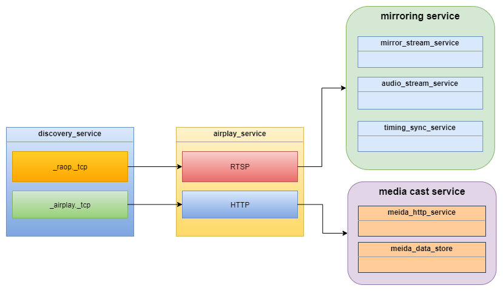

# Overall Architecture

This document is inspired by the [Unofficial AirPlay Protocol Specification](https://nto.github.io/AirPlay.html#introduction). If you don't know what the AirPlay is please look into it and gather related information by Google. Here, I just assume you, the readers, have had a basic knowledge of AirPlay technology. 

AirPlay is not a simple and single protocol but a composition of various protocols such as mDNS, RTSP, HTTP, RTP and NTP. This document aims to describe the architecture of AirPlay server(or receiver) and the interaction flow between the sender and receiver from the view point at runtime.

As mentioned above, AirPlay is a composition of various protocols. We can break it down by different functions as follows:

- Discovery Service
  
  This service exposes the AirPlay service stack to compatible sender devices within the local network by leveraging [multicast DNS (mDNS)](https://en.wikipedia.org/wiki/Multicast_DNS) protocol. Apple created their own implementation named [Bonjour](https://developer.apple.com/bonjour/) which completely conforms to the standard mDNS protocol.

- AirPlay Service (HTTP+RTSP)
  
  This is the primary service to be implemented for AirPlay servers/receivers. This service consists of two protocols: RTSP and HTTP. This service serves for all the requests from senders such as screen mirroring, media cast and photo display. It prepares resources for senders and dispatches different request to corresponding services. No matter what function the senders requests they must establish a session with the AirPlay Service first as the pairing verify process needs to be performed in this session. 
  > **Do not try to implement RTSP and HTTP servers separately, that will make things much more complicated. Just treat HTTP and RTSP as a new protocol (for example XTXP) and create one TCP server to serve both HTTP and RTSP requests simultaneously. We call the new kind of service which serves both RTSP and HTTP requests AirPlay Service. From now on the term *AirPlay Service* in the following documents only represents the TCP service which serves both HTTP and RTSP requests.**

- Screen Mirroring Service
  
  Screen mirroring might be the most popular function of AirPlay stack. This service component consists of video and audio streaming sessions with RTP protocol. The video streaming session uses RTP over TCP while the audio streaming session uses RTP over UDP. Of cause, all streaming payload data is encrypted with AES.

- Media Cast Service (or Media Streaming Service)
  
  Media cast service enables the senders to cast the location information (usually URL) of a media data which resides on the internet servers like Youtube, Netflix or some other third-party media content providers to the AirPlay servers/receivers. Once the AirPlay receiver receives the request it starts to play the media data from the original location and the senders could use the sender APP to control the playback of the media (position, rate, volume, etc.). This service is quite complicated it involves RTSP, HTTP, reversing connection, HLS (cascaded M3U8) and other undiscovered techniques.

- Photo Service (No discuss in this document)
  
  Display photos on the AirPlay servers/receivers or cache them for future use.

 
<em>Overall Architecture of AirPlay Stack</em>

Now let's give a summarize on the AirPlay server components and their responsibilities. The AirPlay server needs to implement at least 4 components to serve the senders.

1. The Discovery Service exposes the AirPlay service to senders. 
2. The AirPlay Service handles the requests from senders, verifies the senders and dispatch the senders to the required function services.
3. The screen mirroring service serves as a client which consuming RTP video/audio streaming from senders.
4. The media cast service receives the media locations from senders and play them from the server side.