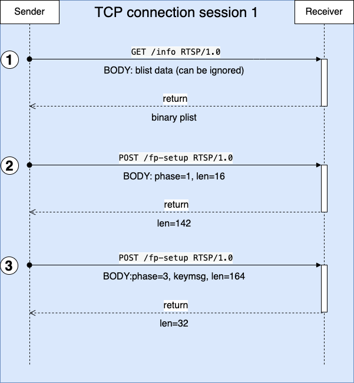

# Pairing Process

Once the sender discovered the AirPlay server, it can get access tot he AirPlay service. No matter what function the sender wants to consume, it must establish a connection session to the AirPlay service. To establish the session, AirPlay server and sender need to verify each other. This is so called pairing process. The diagram below illustrates the interaction between sender and server during the pairing process.

<center>
<a href="images/pairing-interaction.png"></a>
<br/>
<em>Pairing Process Interaction Flow</em>
</center>

1. The sender delivers **GET /info RTSP** request to the server
   
   Request:
   ```
   GET /info RTSP/1.0
   Active-Remote: 4002970562
   CSeq: 0
   Content-Length: 70
   Content-Type: application/x-apple-binary-plist
   DACP-ID: 481EC7990FC1C1C0
   User-Agent: AirPlay/425.1
   X-Apple-ProtocolVersion: 1

   <... binary property list data ...>
   // You may note that this is a request with GET method, but it has body data. 
   ```

   For this request, we can ignore data the body data and response with a binary property list data including required information. For example, reply this request with the following response.

   Response:
   ```
   RTSP/1.0 200 OK
   Audio-Jack-Status: Connected; type=digital
   CSeq: 0
   Date: Tue May  4 14:13:17 2021 GMT
   Server: AirTunes/220.68
   Session: CAFEBABE
   Content-Length: 952
   Content-Type: application/x-apple-binary-plist

   <... binary property list data ...>
   ```

   We can build the response body data as follows:
   ```cpp
   auto_plist info = plist_object_dict(15,
    "deviceID", plist_object_string(config_->deviceID().c_str()),
    "features", plist_object_integer(config_->features()),
    "keepAliveLowPower", plist_object_integer(1), 
    "keepAliveSendStatsAsBody", plist_object_integer(1), 
    "macAddress", plist_object_string(config_->macAddress().c_str()), 
    "model", plist_object_string(config_->model().c_str()), 
    "name", plist_object_string(config_->name().c_str()), 
    "sourceVersion", plist_object_string(config_->serverVersion().c_str()), 
    "statusFlags", plist_object_integer(config_->statusFlag()), 
    "pi", plist_object_string(config_->pi().c_str()), 
    "pk", plist_object_data((uint8_t *)config_->pk().c_str(), (uint32_t)config_->pk().length()),
    "vv", plist_object_integer(config_->vv()), 
    "audioFormats",
    plist_object_array(1,
        plist_object_dict(3, 
            "type", plist_object_integer(96), 
            "audioInputFormats", plist_object_integer(0x01000000),
            "audioOutputFormats", plist_object_integer(0x01000000))),
    "audioLatencies", plist_object_array(1,
        plist_object_dict(4, 
            "type", plist_object_integer(96), 
            "audioType", plist_object_string("default"),
            "inputLatencyMicros", plist_object_integer(0),
            "outputLatencyMicros", plist_object_integer(0)
        )
    ),
    "displays", plist_object_array(1,
        plist_object_dict(11,
            "features", plist_object_integer(14),
            "height", plist_object_integer(config_->display().height()), 
            "heightPixels", plist_object_integer(config_->display().height()),
            "heightPhysical", plist_object_integer(0), 
            "width", plist_object_integer(config_->display().width()), 
            "widthPixels", plist_object_integer(config_->display().width()), 
            "widthPhysical", plist_object_integer(0), 
            "refreshRate", plist_object_real(config_->display().refreshRate()),
            "overscanned", plist_object_true(), 
            "rotation", plist_object_true(), 
            "uuid", plist_object_string(config_->display().uuid().c_str())
        )
    )
   );
   ```

2. The sender delivers **POST /fp-setup RTSP** request to the server

   Request:
   ```
   POST /fp-setup RTSP/1.0
   Active-Remote: 4002970562
   CSeq: 1
   Content-Length: 16
   Content-Type: application/octet-stream
   DACP-ID: 481EC7990FC1C1C0
   User-Agent: AirPlay/425.1
   X-Apple-ET: 32

   <... Binary Data ... >  // used to initialize fairplay verify
   ```

   Response:
   ```
   ```
   
3. The sender delivers **POST /fp-setup RTSP** request to the server
   
   Request:
   ```
   POST /fp-setup RTSP/1.0
   Active-Remote: 4002970562
   CSeq: 2
   Content-Length: 164
   Content-Type: application/octet-stream
   DACP-ID: 481EC7990FC1C1C0
   User-Agent: AirPlay/425.1
   X-Apple-ET: 32
   
   <... Binary Data ... >  // used to initialize fairplay verify
   ```

   Response:
   ```
   ```