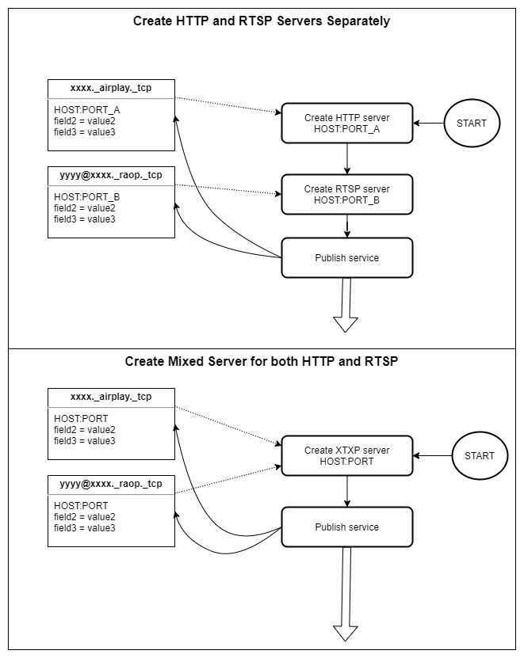

# Service Discovery

When the AirPlay server starts, it will perform the following steps to establish the service stack.
1. Create RTSP server and HTTP server representing the _raop._tcp and _airply._tcp service
   
2. Publish the two services with required information through mDNS protocols.

 
<em>Startup Flow</em>

> **Remember that we said do not create HTTP and RTSP servers separately? Here I describe the two services separately only to make things clear to the reader. We should never implement the two services separately. The PORT_A and PORT_B is the same port in a real world implementation.** 

>**Although they are the same service we still need to and must publish them separately. In one word, publish two services with only one real server.** 

The senders can only get access to the primary services (airplay and raop) through the discovery services. AirPlay server uses mDNS protocol to publish services in the local network so that the senders can discover it without any extra configuration. mDNS is also known as one of [Zero-configuration networking](https://en.wikipedia.org/wiki/Zero-configuration_networking) technologies. For more detailed information about mDNS protocol please refer to the [RFC 6762](https://tools.ietf.org/html/rfc6762) and other more documents provided by search engine. Here in this document we only talk about:

1. What service should be published for AirPlay servers/receiver

2. What information should be included in the published services

## What service should be published

To ensure the senders could discover the AirPlay server, two service must be published with mDNS protocol.

1. _airplay._tcp service

    This service indicates the HTTP server created by the AirPlay server when starting. 
   
2. _raop._tcp service

    This service indicates the RTSP server created by the AirPlay server when starting.

## What information should be included in the published services

1. The most important information is service address: **host** and **port**

    Address information let the senders know your service location.
   
2. The other important information is the **service name**, you need to give correct names to all services. One rule you must not break:
    >  **Raop service name must be followed by *@the-name-of-airplay-service*.**.

    Here an example is. Let's say you named the _airplay service with **my-aprecv**, then you must name the _raop._tcp service as **xxxx@my-aprecv**.

    if you break this rule, the sender will never discover your AirPlay server.

3. Besides the above information, some more information are still required to make the server work. Please continue on the following subsections.

If all services was published successfully and correctly, it should look like the picture below. (you can use service browser to check whether your service is published correctly or not)

 
<em>Published AirPlay Services</em>

